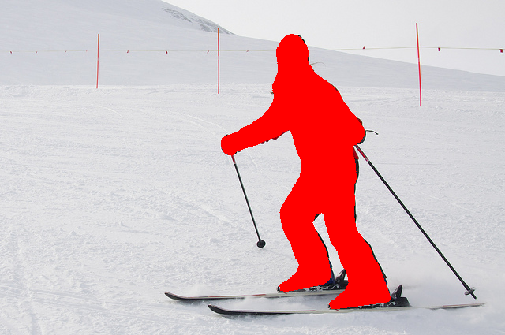

# Pose2Seg running on your dataset
I do some job to make Pose2Seg run on my dataset.

You can git clone this repo and follow the instructions following to make Pose2Seg run on your dataset or single image.

This programme is still very naive. I just use this programe for test and get a poor result in my application scenarios. So I will not give more effort on this programme, unless someone have some interest on it.

## 1 git clone AlphaPose
Note that, Pose2Seg need images and pose as its input. So, if you don't have any keypoints result on your images, or your keypoints result may not satisfy Pose2Seg, you should first git clone [AlphaPose](https://github.com/MVIG-SJTU/AlphaPose). You can use this programme to get a COCO Format 17 keypoints of you images. 

You can get some instructions in its Readme file.

## 2 build a conda environment
You can use the same environment as Pose2Seg. And you can get my env in pose2seg.yml.


## 3 transform AlphaPose result format to Pose2Seg format
After get the keypoints result from AlphaPose, you can use a script to transform the AlphaPose result to Pose2Seg format result.

Here is some part of mine:
```python
    def trans_to_coco_format(self):
        skeleton_list = [[16, 14], [14, 12], [17, 15], [15, 13], [12, 13], [6, 12], [7, 13], [6, 7], [6, 8], [7, 9],
                         [8, 10],
                         [9, 11], [2, 3], [1, 2], [1, 3], [2, 4], [3, 5], [4, 6], [5, 7]]
        keypoint_name_list = ["nose", "left_eye", "right_eye", "left_ear", "right_ear", "left_shoulder",
                              "right_shoulder", "left_elbow", "right_elbow", "left_wrist", "right_wrist",
                              "left_hip", "right_hip", "left_knee", "right_knee", "left_ankle",
                              "right_ankle"]
        # 得到 images 和 annotations
        coco_query_images_list = []
        coco_test_images_list = []
        coco_train_images_list = []
        coco_query_annotations_list = []
        coco_test_annotations_list = []
        coco_train_annotations_list = []
        image_name_to_id = {}
        img_id = 0
        anno_id = 0
        for i in range(len(self.annotations_list)):
            int_keypoints = []
            image_name = self.annotations_list[i]["image_id"]
            image_path = self.img_name_path_dir[image_name]
            image_size = imagesize.get(image_path)

            # 那这里得判断一下这个图片是不是新出现的
            new_image_flag = False
            if image_name not in image_name_to_id:
                image_name_to_id[image_name] = img_id
                img_id = img_id + 1
                new_image_flag = True
            image_id = image_name_to_id[image_name]

            for k in self.annotations_list[i]["keypoints"]:
                int_keypoints.append(int(round(k, 0)))

            annotation = {"image_id": image_id,
                          "area": 1,
                          "num_keypoints": len(self.annotations_list[i]["keypoints"]),
                          "iscrowd": 0,
                          "id": anno_id,
                          "category_id": 1,
                          "keypoints": int_keypoints,
                          'segmentation': [[]],
                          'bbox': [0, 0, 2, 2]
                          }

            # 这里的id不应该是单独的img_id
            image = {"id": image_id,
                     "file_name": image_name,
                     "height": image_size[1],
                     "width": image_size[0]
                     }

            if image_path.find("query") != -1:
                coco_query_annotations_list.append(annotation)
                if new_image_flag:
                    coco_query_images_list.append(image)
            elif image_path.find("bounding_box_test") != -1:
                coco_test_annotations_list.append(annotation)
                if new_image_flag:
                    coco_test_images_list.append(image)
            else:
                coco_train_annotations_list.append(annotation)
                if new_image_flag:
                    coco_train_images_list.append(image)
            anno_id = anno_id + 1
            utils.progress_bar(anno_id, len(self.annotations_list))

        print("total images: " + str(img_id))
        print("total annotations: " + str(anno_id))

        # 得到 categories
        coco_categories = [{"supercategory": "person",
                           "id": 1,
                           "name": "person",
                           "keypoints": keypoint_name_list,
                           "skeleton": skeleton_list
                           }]
        coco_images_list = [coco_query_images_list, coco_test_images_list, coco_train_images_list]
        coco_annotations_list = [coco_query_annotations_list, coco_test_annotations_list, coco_train_annotations_list]
        subfolder_name_list = ["query", "test", "train"]
        for i in range(3):
            coco_format_data = {"images": coco_images_list[i],
                                "annotations": coco_annotations_list[i],
                                "categories": coco_categories}
            json_str = json.dumps(coco_format_data)
            json_file_name = "coco_format_" + subfolder_name_list[i] + ".json"
            json_file = open(os.path.join(self.pose_img_folder_path, json_file_name), "w")
            json_file.write(json_str)
```

Note that, `area`, `segmentation` and `bbox` in `annotations` is not nesserary for running on own datasets, said buy Pose2Seg creater, so I give it a fixed value.

## 4 place your images and pose file
Before get segmentation result of Pose2Seg, you should place your images and pose file in the folder named ```Pose2Seg/data/```, the folder instructure is as below.
```
data
├── coco2017 
│ ├── annotations
│ │ ├── person_keypoints_val2017_pose2seg.json 
│ ├── val2017
│ │ ├── ####.jpg
```
As you can see, I do some change from Pose2Seg folder instructure. Because, I don't need any training file for test its proformance in my dataset.

## 5 do testing
You can get into ```Pose2Seg/``` and use the command below to run this test on your dataset:
```bash
python test.py --weights pose2seg_release.pkl --coco
```
You will see output result in  ```Pose2Seg/output``` folder. The segment part will be showed with **red color** as following:

\


You can change this color in test.py in line 49.

>
># Pose2Seg
>
>*Official* code for the paper "Pose2Seg: Detection Free Human Instance Segmentation"[[ProjectPage]](http://www.liruilong.cn/projects/pose2seg/index.html)[[arXiv]](https://arxiv.org/abs/1803.10683) @ CVPR2019.
>
>The *OCHuman dataset* proposed in our paper is released [here](https://github.com/liruilong940607/OCHumanApi)
>
><div align="center">
>
><p> Pipeline of our pose-based instance segmentation framework.</p>
></div>
>
>## Setup environment
>
>``` bash
>pip install cython matplotlib tqdm opencv-python scipy pyyaml numpy
>pip install torchvision torch
>
>cd ~/github-public/cocoapi/PythonAPI/
>python setup.py build_ext install
>cd -
>```
>
>## Download data
>
>- COCO 2017
>    - [COCO 2017 Train images [118K/18GB]](http://images.cocodataset.org/zips/train2017.zip)
>    - [COCO 2017 Val images [5K/1GB]](http://images.cocodataset.org/zips/val2017.zip)
>    - [COCOPersons Train Annotation (person_keypoints_train2017_pose2seg.json) [166MB]](https://github.com/liruilong940607/Pose2Seg/releases/download/data/person_keypoints_train2017_pose2seg.json)
>    - [COCOPersons Val Annotation (person_keypoints_val2017_pose2seg.json) [7MB]](https://github.com/liruilong940607/Pose2Seg/releases/download/data/person_keypoints_val2017_pose2seg.json)
>    
>- OCHuman
>    - [images [667MB] & annotations](https://cg.cs.tsinghua.edu.cn/dataset/form.html?dataset=ochuman)
>    
>**Note**: 
>`person_keypoints_(train/val)2017_pose2seg.json` is a subset of `person_keypoints_(train/val)2017.json` (in [COCO2017 Train/Val annotations](http://images.cocodataset.org/annotations/annotations_trainval2017.zip)). We choose those instances with both keypoint and segmentation annotations for our experiments.
>
>## Setup data
>
>The `data` folder should be like this:
>
>    data  
>    ├── coco2017
>    │   ├── annotations  
>    │   │   ├── person_keypoints_train2017_pose2seg.json 
>    │   │   ├── person_keypoints_val2017_pose2seg.json 
>    │   ├── train2017  
>    │   │   ├── ####.jpg  
>    │   ├── val2017  
>    │   │   ├── ####.jpg  
>    ├── OCHuman 
>    │   ├── annotations  
>    │   │   ├── ochuman_coco_format_test_range_0.00_1.00.json   
>    │   │   ├── ochuman_coco_format_val_range_0.00_1.00.json   
>    │   ├── images  
>    │   │   ├── ####.jpg 
>
>## How to train
>
>``` bash
>python train.py
>```
>
>**Note**: Currently we only support for single-gpu training.
>
>## How to test
>
>This allows you to test the model on (1) COCOPersons val set and (2) OCHuman val & test set.
>
>``` bash
>python test.py --weights last.pkl --coco --OCHuman
>```
>
>We retrained our model using this repo, and got similar results with our paper. The final weights can be download [here](https://drive.google.com/file/d/193i8b40MJFxawcJoNLq1sG0vhAeLoVJG/view?usp=sharing).
>
>## About Human Pose Templates in COCO
>
><div align="center">
>
><p> Pose templates clustered using K-means on COCO.</p>
></div>
>
>This repo already contains a template file `modeling/templates.json` which was used in our paper. But you are free to explore different cluster parameters as discussed in our paper. See [visualize_cluster.ipynb](visualize_cluster.ipynb) for an example.
>
>
